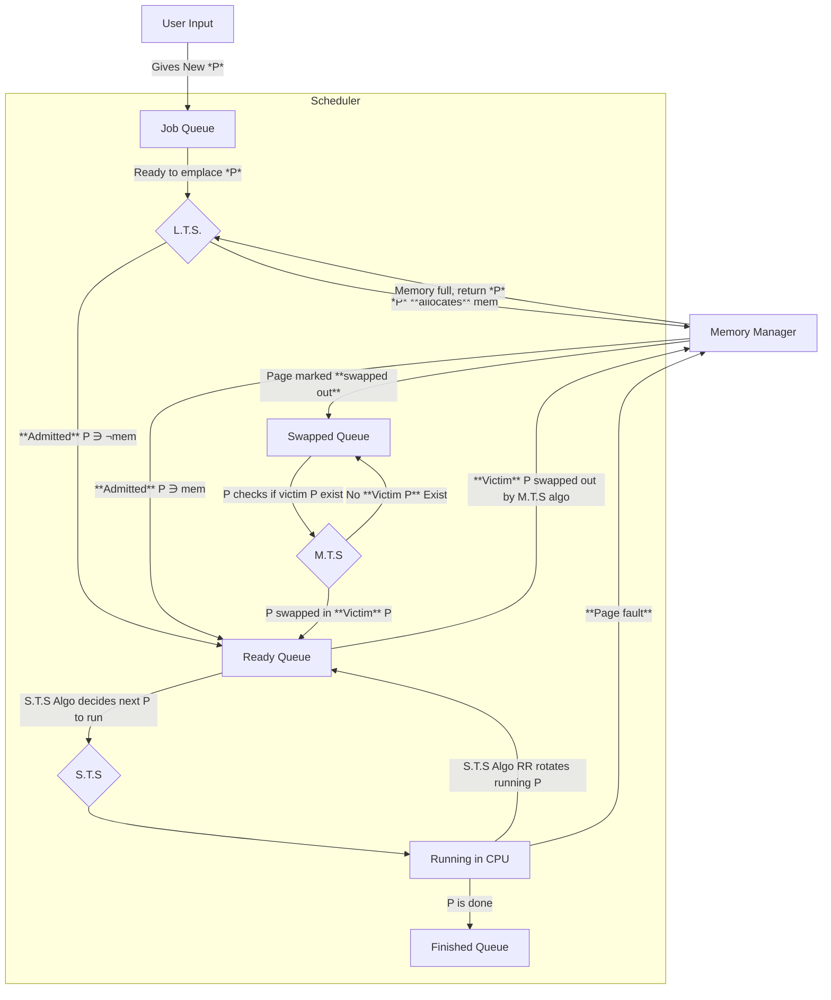
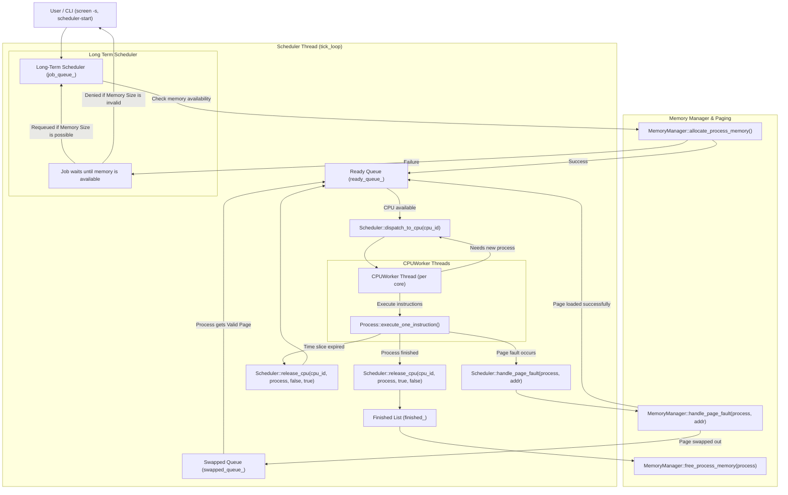

# Scheduler Class

## High Level Process flow

## Low Level Process flow

## Ready Queue

Ready Queue implementation needs to satisfy both short term queue and medium term queue.

- It needs to be a Channel like in go-lang, a FIFO data structure.

- It needs to select among the element the one with "least priority"; it has the ability to choose "a victim". This suggests a data structure that has a property of queue but be able to use some algorithm to select a victim. The closest to this is a multi-set `https://www.geeksforgeeks.org/cpp/multiset-in-cpp-stl/`.

- It needs to change the algorithm midway